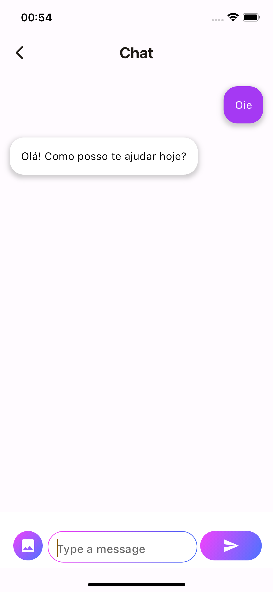
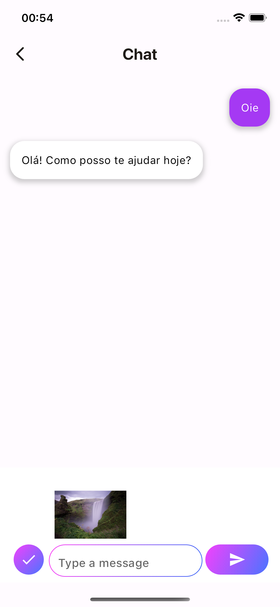
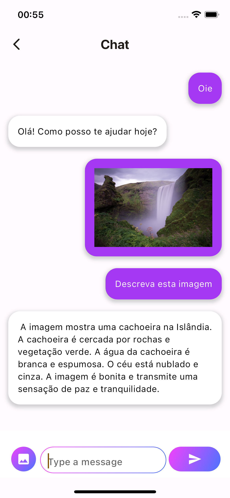

# Flutter Gemini

Repository to test GEMINI using Flutter.

I followed this [tutorial](https://medium.com/google-developer-experts/chatbot-with-multimodality-features-using-flutter-and-gemini-13ea8ff7d55f#4460) by Esther Irawati Setiawan. But I tried to change a little bit so I can learn more.

## The differences from tutorial
- I am using the `.env` file to keep the API Key.
- I added a presenter file to be responsible for logic
- I added a repository to get the data from gemini
- I also added a manager so I can use the engine anywhere
- I am also using delegate pattern to communicate with the view
- And the `setState` method to update the widgets

## Layout differences
- I changed colors
- I am showing the selected image
- I tried to get chat history, but I couldn't get the chat history when I sent an image YET. 

### Screenshots
| Home | Chat Page | Chat Image Selected | Chat Image Sent |
| ---- | --------- | ------------------- | --------------- |
|  |  |  |  |

